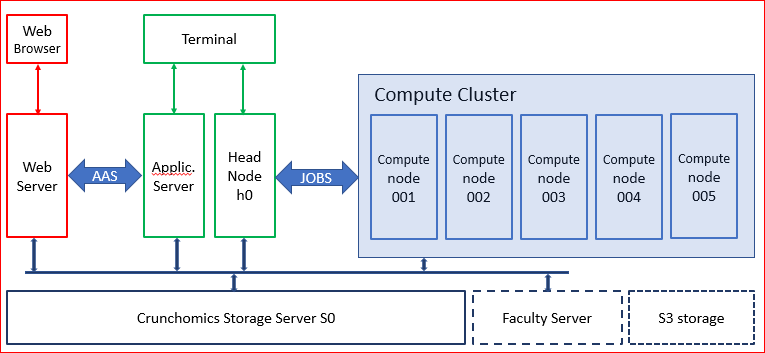

.. crunchomics documentation master file, created by
   sphinx-quickstart on Tue Jan 19 13:54:30 2021.
   You can adapt this file completely to your liking, but it should at least
   contain the root `toctree` directive.

*The Crunchomics’ Documentation*
++++++++++++++++++++++++++++++++++++++++

*Crunchomics: The Genomics Compute Environment for SILS and IBED*
====================================================================

Cruchomics has 1 application server, a web server, a head node and 5 compute nodes. A storage system is mounted in which all users have a fast 25 GB SSD home directory and a 500 GB home directory. Volumes from the faculty server can be mounted on the system. 

* CPU: AMD EPYC Rome 7302 32 cores, 64 threads, 3GHz
* Compute cluster: 160 cores, 320 threads
* Infiniband internal connection
* Local storage compute cluster: 8TB (SSD/NVMe): /scratch
   * /scratch is emptied after month of inactivity
* Memory:
   * Web server: 256 GB
   * Application server: 1024 GB 
   * Head node and compute nodes: 512 GB 
* Storage: gross 504 TB operated in RAID-Z2: net approx. 220 TB.
   * If one disk fails: no data loss
   * Snapshots taken: some protection against unintentional file deletions
   * No backups made!
* File systems are mounted on all nodes.
* OS: CentOS 7
* Help: w.c.deleeuw@uva.nl / j.rauwerda@uva.nl

.. toctree::
   :maxdepth: 4
   :numbered:
   
   self
   intro_crunchomics.rst
   miniconda.rst
   slurm_overview.rst
   slurm_jobs.rst
   slurm_indirect.rst
   nvme_clusters.rst
   containers.rst

Indices and tables
==================

* :ref:`genindex`
* :ref:`search`

