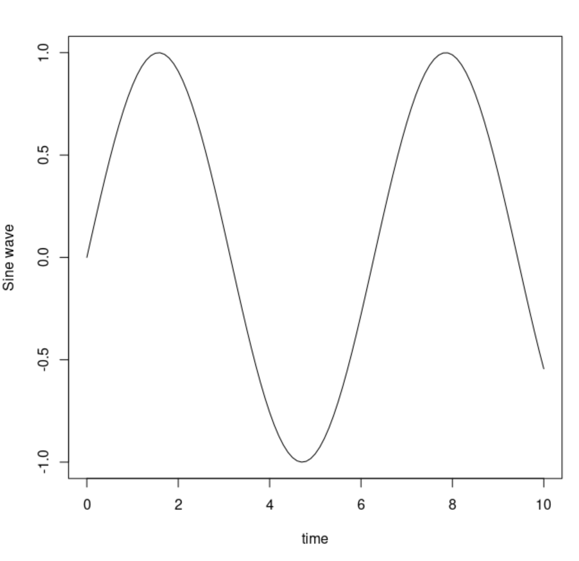
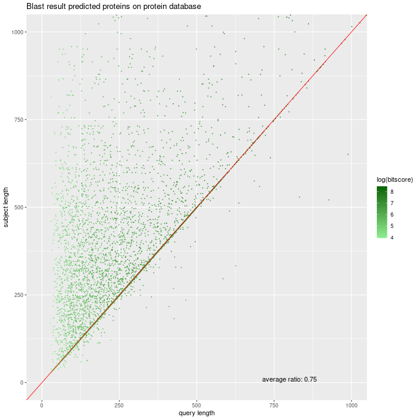

Log in on the Head Node
#######################

*  Remark: if you are outside UvA, use VPN.

*  from your local (desktop or laptop) machine
    *  start puTTY or mobyxterm (windows)
    *  start terminal program (mac)
    *  start xterm or konsole (linux)
    
On Windows
**********

*  Connect via `MobaXterm <https://mobaxterm.mobatek.net/?gclid=CjwKCAiAkan9BRAqEiwAP9X6UaGJEwztxdR2mR-EKW5C7hyQPHwVvA3ypPrKCqQQEONI6LBwS6WsrRoC2a8QAvD_BwE/>`_ (includes X11 graphical output) or `PuTTY <https://www.putty.org/>`_.
*  MobaXterm facilitates to remember passwords.
  
*  Via MobaXterm interface (address is omics-h0.science.uva.nl):  
	.. figure:: img/inlog.png
		:width: 500px
		:align: center
		:height: 350px

Login Without a Password with RSA Keys
======================================

*  An explanation on how to use SSH keys (existing ones or newly generated) can be found here: `SSH keys with PuTTY <https://devops.ionos.com/tutorials/use-ssh-keys-with-putty-on-windows/>`_
*  If you don't want to use the *Remember Password* mechanism in MobaXterm but still do not want to supply your password each time you login, you can configure MobaXterm also for use of SSH keys. 
	*  Start a local terminal with MobaXterm and type::

		if [  -f ~/.ssh/id_rsa.pub ] ; 
			then  echo "Public key found."; 
			else ssh-keygen -t rsa ; 
		fi
	*  Type enter 3 times unless you want to use a passfrase for the key. Copy de public part key to the file .ssh/authorized_keys on omics-h0. Here you have to type the password a last time. In your local terminal type::

		cat ~/.ssh/id_rsa.pub  | \
		ssh uvanetid1@omics-h0.science.uva.nl \
		'mkdir -p .ssh && cat >> .ssh/authorized_keys'
	*  You can use the ssh key pair in MobaXterm by giving the location of the private key (it is in your local 'persistent' home directory, normally but depending on your windows version C:\\Users\\<YOUR_WINDOWS_LOGIN_NAME>\\DOCUMENTS\\MobaXterm\\home\\.ssh)
	* .. figure:: img/inlog2.png 
		:width: 500px 
		:align: center 
		:height: 350px 
		:alt: inlog splash 2 mobaxterm 
		:figclass: align-center
	*  Or: use the key generator mechanism in MobaXterm

On Linux and Mac
****************
    
*  Via a terminal::

	#replace uvanetid1 with your uvanetid:
	ssh -X uvanetid1@omics-h0.science.uva.nl
	# -X for X11 graphical output 
	xclock
	# if you see a clock xwindows works

Login Without a Password with RSA Keys
======================================

*  Login using rsa keys: on the local system generate key if it doesn't exist::
 
	if [  -f ~/.ssh/id_rsa.pub ] ; \
		then  echo "Public key found."; 
		else ssh-keygen -t rsa ; 
	fi
*  Type enter 3 times unless you want to use a passfrase for the key. Copy de public part key to the file .ssh/aurhorized_keys on omics-h0. Here you have to type the password a last time::

	cat ~/.ssh/id_rsa.pub  | \
	ssh uvanetid1@omics-h0.science.uva.nl \
	'mkdir -p .ssh && cat >> .ssh/authorized_keys'

*  Test if it works. Now you should be logged without being asked a password::

	ssh uvanetid1@omics-h0.science.uva.nl

Preparing Your Account
######################

Getting Your Environment Ready
******************************

*  You want to:
    *   use system wide installed software: ``/zfs/omics/software/bin`` is added to your path
    *   have a python3 environment available + (genomics) specific packages such as *pandas* and *snakemake* installed: ``madpy3`` can be used as a command to activate the madpy3 environment
    *   have a more informative prompt 
    *   have, in your ultrafast home directory a link to your 500 GB *personal* directory on the file storage.

A script to do the things mentioned above for you is here, type on your head node shell::

	/zfs/omics/software/script/omics_install_script

This script will change the .bashrc and .bash_profile files such that the requirements mentioned above are fullfilled. 

DIY
===

*  If you want to make the adaptations yourself, here are some ideas:

*  Create a shortcut (softlink) in your home directory (25GB) to your personal directory (500 GB)::

	ln -s /zfs/omics/personal/$USER ~/personal
*  Update the PATH variable in your *.bashrc* file so you can use the software installed in ``/zfs/omics/software``. This is software not installed by the package manager, such as R, bowtie2, samtools etc.::  
    
	export PATH=${PATH}:/zfs/omics/software/bin
*  Some tools, such as snakemake, htseq, etc. need python3 and can be executed in a python virtual environment.
*  Activate the virtual environment as follows::

	which snakemake
	#which: no snakemake 
	source /zfs/omics/software/v_envs/madpy3/bin/activate
	which snakemake
	#/zfs/omics/software/v_envs/madpy3/bin/snakemake
	deactivate

Account
#######

* The quota for storage are:
   * 25GB in your home directory 
   * 500GB in /zfs/omics/personal/$USER 
* The quota also apply to snapshots. Snapshots are made daily at 00.00.00 and kept for 2 weeks. This means that deleting files which are in a snapshot will not be available for another 2 weeks. It also means that if you accidentally remove a file it can be restored up to 2 weeks after removal.
* Data on Crunchomics is stored on multiple disks. Therefore, there is protection against disk failure. The data is not replicated. SILS users are encouraged to put their raw data on tape as soon as these are produced: `SILS tape archive <http://sils-tape.science.uva.nl/requestform.php/>`_. Tape storage is duplicated. 
* Help: w.c.deleeuw@uva.nl / j.rauwerda@uva.nl

The Crunchomics Application Server
#############################################

The address of the application server is `omics-app01.science.uva.nl` and you can log in to it in a similar fashion as you log in to the headnode. Your home and personal directory as well as other locations on the file system are also available on the application server.

CLC Genomics Workbench
**********************

*  log in on the application server: address is `omics-app01.science.uva.nl` (**not** the headnode!!)::

	#in terminal type:
	clcgenomicswb20

*  Remember, your home directory is 25G, so it is advisable to make your **default location** somewhere on /zfs/omics/personal/*uvanetid1*/
    *  add a new folder in CLC genomics workbench (e.g. ``/zfs/omics/personal/*uvanetid1*/CLC_personal``)
	.. figure:: img/CLC-1.png 
		:width: 300px 
		:align: center 
		:height: 300px 
    *  and make it the *default location*
	.. figure:: img/CLC-2.png 
		:width: 300px 
		:align: center 
		:height: 450px 

Start RStudio
*************

*  We are currently setting up a log in to RStudio with your uvanetid via Surfconnect. This Surfconnect access is not available yet. Until then you can login directly on the application server.
    *  Login to RStudio on the application server with your UvAnetid and password at: `http://omics-app01.science.uva.nl:8787/`. Don't forget to include the port number (8787) in your url.

The Crunchomics Compute Cluster
##########################################

Interactive access
******************

Interactive work on the head node `omics-h0.science.uva.nl` is possible but **only for small computational tasks. All other jobs should be executed via the SLURM queue!!**. 

* You can run interactive jobs on the head node
   * small jobs
   * parameterization of a big job, pilot jobs
   * Only run jobs interactively when they take less than 12 hrs execution time on one cpu.
* If you have a job for which a really large amount of memory is needed, such as a genome assembly, you can use the app server that has 1TB memory installed.
   * Mark that the compute nodes have a 512 GB memory each, so many assembly jobs can better be put to the compute cluster. 
      
Example of Interactive R Sessions
========================================

*  connect to the head node (with X), start R
*  a simple example in the kick-off meeting (in R)::

	t=seq(0,10,0.1)
	y=sin(t)
	plot(t,y,type="l", xlab="time", ylab="Sine wave")

Another example:
* a file is read (the result of a BLAST alignment) and the ratio of the query length and subject length are plotted, together with x=y::

	xclock&
	wget https://surfdrive.surf.nl/files/index.php/s/9xIik2oVfjA8VVg/download \
 	--output-document blp.txt

* Next, in R

.. code-block::	R

	blp<-read.table("blp.txt", header=T)
	head(blp)
	x11(type="cairo")
	library(ggplot2)
	lbl<-paste("average ratio:",round(mean(blp$qlen/blp$slen),2))
	lbl
	plot1<-ggplot(blp,aes(qlen,slen,colour=log(bitscore))) +
	#scale_colour_gradientn(colours=rainbow(8)) + 
	scale_colour_gradient(low="lightgreen",high="darkgreen") +
	geom_point(size=0.5, alpha=18/20, shape=20) +
	coord_cartesian(ylim = c(0, 1000),xlim =  c(0,1000)) +
	geom_abline(slope=1, intercept=0, alpha=0.8, colour="red") + 
	labs(x = "query length", y="subject length", title = "Blast result predicted proteins on protein database") + 
	annotate("text", label = lbl, x = 800, y = 10)
	plot1
	#png("/zfs/omics/personal/jrauwer1/Crunchomics_intro/plot_blast_qlen_slen.png",width=700, height=700, type="cairo" )
	#plot1
	#dev.off()

