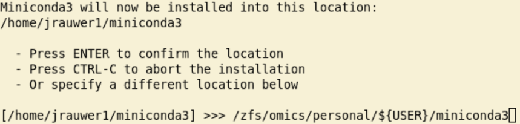
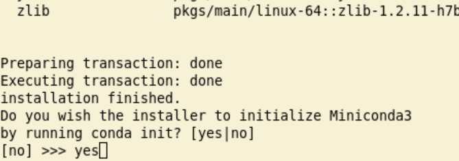
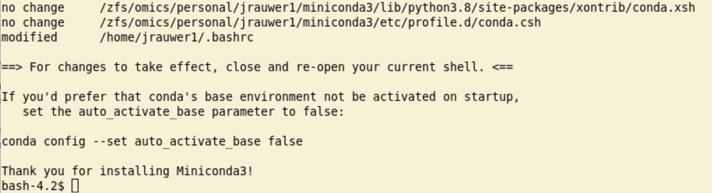
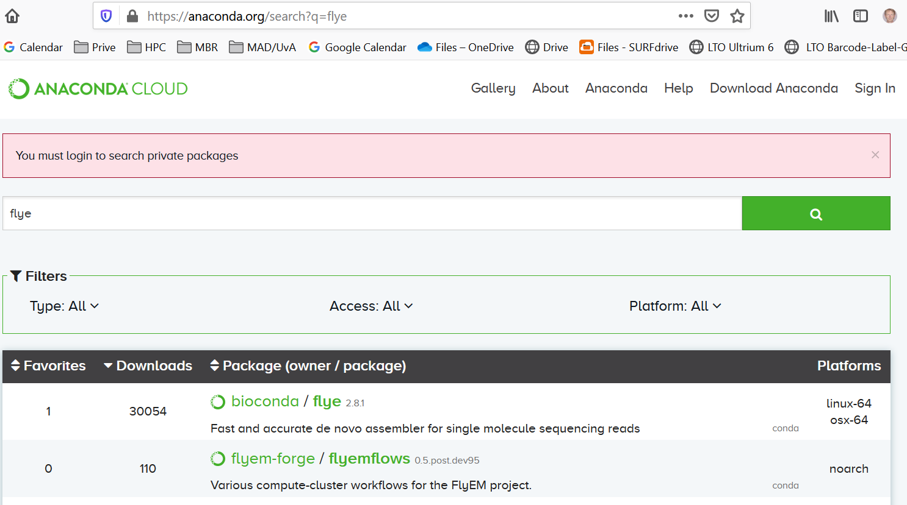
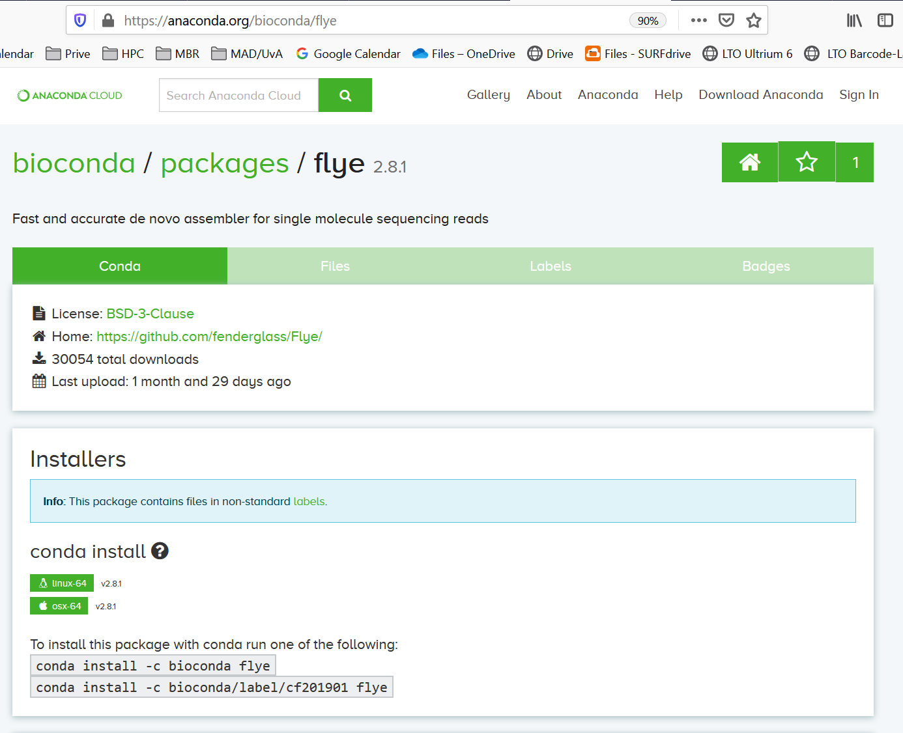

Miniconda
#########

*  Conda is an open source package management system and environment management system. Conda allows you find and install packages in your own environment. You don't need administrator privileges.
*  If you need a package that requires a different version of Python, you use conda as an environment manager. With just a few commands, you can set up a totally separate environment to run that different version of Python, while continuing to run your usual version of Python in your normal environment.

Installation
************

*  basic install is 89M
*  other packages will require additional space, so rather install it in ``/zfs/omics/personal/<uvanetid1>`` than in your ``/home/<uvanetid1>``

Get miniconda
=============

Download it

.. code-block::	bash

        cd /zfs/omics/personal/${USER}
        wget https://repo.anaconda.com/miniconda/Miniconda3-latest-Linux-x86_64.sh

Install Miniconda
=================

Run the install script (as you)

.. code-block::	bash

        bash Miniconda3-latest-Linux-x86_64.sh

*  Read the license information and answer yes..... After you answered yes, you will see a message like:

*  Specify here ``/zfs/omics/personal/${USER}/miniconda3`` (or replace ``\${USER}`` with your uvanetid).
*  When the installation has finished you are asked if you want to initialize conda. Answer *yes*:

*  This finishes the installation:

*  After the installation, to have a shell with conda, leave your current one and start a new one or type:

.. code-block::	bash
  	
	source ~/.bashrc

*  After you have done this, you will see *(base)* as a prefix in your shell prompt.

*  So, each time you start a shell, conda will be activated, if you don't want that, type:

.. code-block::	bash

	conda config --set auto_activate_base fals

*  How much space does miniconda3 take?

.. code-block::	bash

	cd /zfs/personal/${USER}/
	du -hs miniconda3/
	#437M    miniconda3/

Installation of a Conda Package
*******************************

*  Suppose, you want to make a bacterial assembly with flye. With ``which flye`` you discover that flye is not installed on Crunchomics. Of course, you can ask the maintainers of Crunchomics to install flye. But you also could install flye as a conda package. You go to https://anaconda.org/ and search for *flye*
*  There is a conda package available:

*  When you click on flye you get a link with installation details:

*  Suppose you don't want flye in your base environment. Therefore, you create a new environment that you call nptools. Install flye in the nptools evironment, deactivate base and activate nptools:

.. code-block::	bash

	which flye  #indeed, no flye
	conda create -n nptools
	conda install -n nptools -c bioconda flye
	conda deactivate 
	conda activate nptools
	flye -h
	#usage: flye (--pacbio-raw | --pacbio-corr | --pacbio-hifi | --nano-raw |
	#             --nano-corr | --subassemblies) file1 [file_2 ...]
	#             --genome-size SIZE --out-dir PATH
	conda env list
	conda deactivate
	flye
	#bash: flye: command not found
	#
	du -hs /zfs/personal/${USER}/miniconda3/
	#820M    miniconda3/

*  Look what is in your environment with:

.. code-block::	bash

	conda list -n nptools
	conda list -n base

Example: Using Conda Installation of Flye
========================================= 

.. code-block::	bash

	conda deactivate 
	conda activate nptools
	cd /zfs/omics/personal/${USER}/
	mkdir -p ecoli
	cd ecoli
	wget https://zenodo.org/record/1172816/files/Loman_E.coli_MAP006-1_2D_50x.fasta
	date
	flye --nano-raw Loman_E.coli_MAP006-1_2D_50x.fasta --out-dir . --threads 4
	date

 
