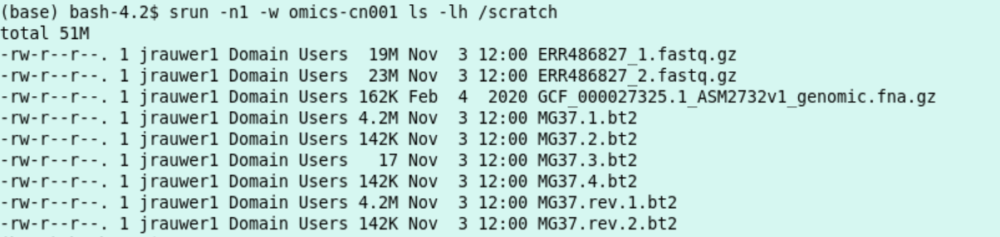
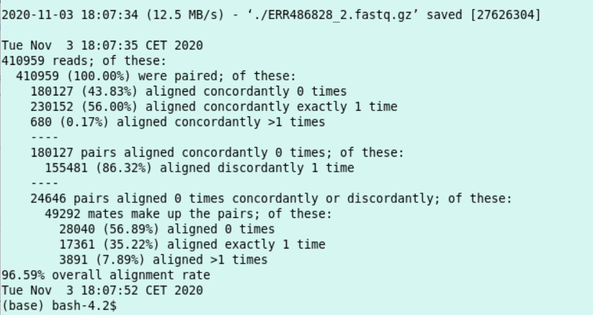
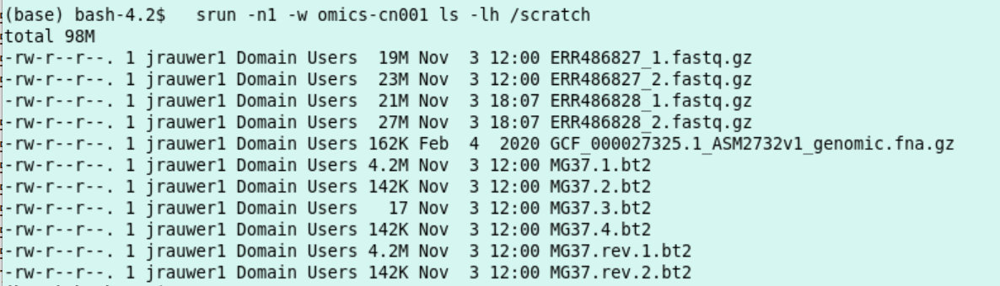

Use of Local NVMe Storage on Compute Nodes
##################################################

Each compute node in the cluster has 7.3TB local and very fast NVMe storage available in /scratch. By storing temporary and/or much accessed data on the scratch disk, file access times can be improved significantly. It also reduces the load on the filer which will benefit all users.  However as local storage it can be only accessed on a particular node. So either data has to be synchronized over all nodes, or jobs have to be fixed on particular nodes using the ``-w flag`` 

*  You might remember that in the *Multithreaded bowtie2 example* we used the local /scratch disk to copy the genome index and the fastq files to. The alignment job was calculated (in this particular case on cn001).
    *  These files are **not** automatically removed when the job has finished. So multiple jobs can access and further process data in scratch. 
    * To prevent /scratch from filling up, files which have not been accessed (read or written) for (currently) a month are removed. The time unused files are removed might be reduced if the file system fills up too quickely. 
    *  This policy makes it possible to reuse large files on the local /scratch disk on a compute node. For instance, look at the scratch of cn001:

.. code-block:: bash

    srun -n1 -w omics-cn001 ls -lh /scratch

*  Here we make use of the genome index on cn001 while doing an alignment with 2 new files (save the file below as align_Mycoplasma3.sh):

.. code-block:: bash
 
	#!/bin/bash
	#
	#SBATCH --job-name=align_Mycoplasma
	#SBATCH --output=res_alignjob.txt
	#
	#SBATCH --ntasks=1
	#SBATCH --cpus-per-task=8
	#SBATCH --time=10:00
	#SBATCH --mem-per-cpu=2000
	#
	WD="/scratch/$USER"
	mkdir -p $WD    
	cd $WD
	#
	#test if the Mycoplasma genome is already there, download it and build the index if not.
	fl="GCF_000027325.1_ASM2732v1_genomic.fna.gz"
	if [ ! -f "${fl}" ]; then
    		srun wget https://ftp.ncbi.nlm.nih.gov/genomes/all/GCF/000/027/325/GCF_000027325.1_ASM2732v1/GCF_000027325.1_ASM2732v1_genomic.fna.gz -P ./
    		srun bowtie2-build GCF_000027325.1_ASM2732v1_genomic.fna.gz MG37
	fi
	#
	#only download the 2 illumina files if they are not there
	fl="ERR486828_1.fastq.gz"
	if [ ! -f "${fl}" ]; then
		srun wget ftp://ftp.sra.ebi.ac.uk/vol1/fastq/ERR486/ERR486828/ERR486828_1.fastq.gz -P ./
	fi
	#
	fl="ERR486828_2.fastq.gz"
	if [ ! -f "${fl}" ]; then
		srun wget ftp://ftp.sra.ebi.ac.uk/vol1/fastq/ERR486/ERR486828/ERR486828_2.fastq.gz -P ./
	fi
	#
	date
	srun bowtie2 -x MG37 -1 ERR486828_1.fastq.gz -2 ERR486828_2.fastq.gz --very-fast -p $SLURM_CPUS_PER_TASK -S /zfs/omics/personal/${USER}/result_ERR486828.sam
	date
 
*  execute with ``sbatch -w omics-cn001 align_Mycoplasma3.sh``  
*  from ``tail -n21 res_alignjob.txt``: 

*  I conclude the script succeeded.
*  look at the /scratch directory:

.. code-block:: bash
 
    srun -n1 -w omics-cn001 ls -lh /scratch

*  Indeed, the index MG37 is reused (timestamp 12:00) and the two fastq files ending on 28 are newly downloaded (timestamp 18:07).

*  Obviously, this way of working is especially useful if there is a lot of IO. The size of the local scratch is net 7.3 TB.

.. code-block:: bash
 
	srun -n1 -w omics-cn001 df -h /scratch

