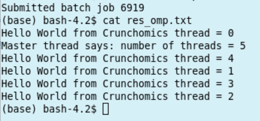
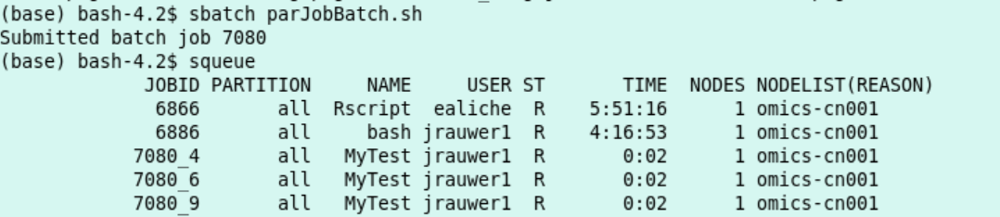
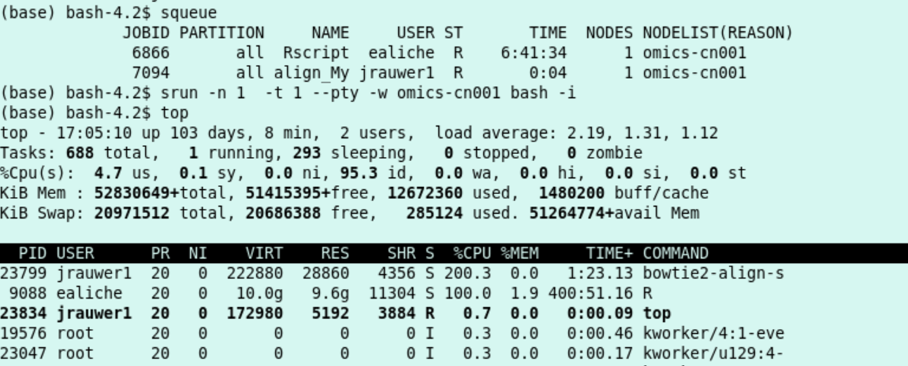

Slurm Jobs
#############

Jobs and Job Steps
******************

* A compute job can consist of several steps. For example: you download the files, you down sample and then you do an alignment. These steps are job steps and are invoked by ``srun`` from with in the batch script. Each srun command in a batch script can ask for its own set of resources as long as it fits in the allocation. In other words the srun commands in a batch script are bounded by the allocation for the batch script. For example an srun can not ask for more cpu's than asked for in the sbatch file. 
* Some useful srun flags are:
   * -c, --cpus-per-task=ncpus   number of cpus required per task
   * -n, --ntasks=ntasks         number of tasks to run
   * -N, --nodes=N               number of nodes on which to run (N = min[-max])
   * -o, --output=out            location of stdout redirection
   * -w, --nodelist=hosts        request a specific list of hosts

* Print the name of the node with the command ``hostname``

.. code-block:: bash

	srun hostname
	#omics-cn004  this job was allocated to cn004

* Carry out this task four times:

.. code-block:: bash

	srun -n4 hostname
	#omics-cn004
	#omics-cn004
	#omics-cn004
	#omics-cn004  again allocation on cn004

Note that the effect of the -n4 flag is that the program (hostname) is automatically started 4 times. For software which runs on multiple nodes and commucates between instances through mpi this is useful. In case of a multi threaded program it is usually not what you want. 

* Now, ask for four nodes

.. code-block:: bash

	srun -N4 hostname
	#omics-cn002
	#omics-cn003
	#omics-cn001
	#omics-cn004  now, cn001, cn002, cn003 and cn004 are allocated

* Ask for a specific host:

.. code-block:: bash

	srun -n2 -w omics-cn002 hostname
	#omics-cn002
	#omics-cn002

* Output to a file (here: hn.txt that is stored in your current directory)

.. code-block:: bash

	srun -N3 -n5 -o hn.txt hostname
	cat hn.txt
	#omics-cn001
	#omics-cn001
	#omics-cn002
	#omics-cn002
	#omics-cn003  #001 and 002 are used twice, 003 is used once

*  A job consists in two parts: resource requests and job steps. Resource requests consist in a number of CPUs, computing expected duration, amounts of RAM or disk space, etc. Job steps describe tasks that must be done, software which must be run.

*  The typical way of creating a job is to write a submission script. A submission script is a shell script, e.g. a Bash script, whose comments, if they are prefixed with SBATCH, are understood by Slurm as parameters describing resource requests and other submissions options. You can get the complete list of parameters from the sbatch manpage ``man sbatch``.
*  get hints for writing a job script at the script generator wizzard `Script Generator Wizzard Ceci <http://www.ceci-hpc.be/scriptgen.html>`_ Ignore the cluster names and replace ``#SBATCH --partition=defq`` with ``#SBATCH --partition=all``).

Batch jobs: sbatch
****************** 

*  Make a text file with the content as in the box below and save it as batch1.sh:
    *  it writes the output to the file res.txt
    *  it consists of one task
    *  it allocates 10 minutes of compute time and 10 MB memory
    *  I expect this script to run at least 15 seconds and to print 3 hostnames and 3 dates.
    *  I can execute the script with ``sbatch sbatch1.sh`` and monitor the script with ``squeue`` 
    
.. code-block:: bash

	#!/bin/bash
	#
	#SBATCH --job-name=batch1
	#SBATCH --output=res.txt
	#
	#SBATCH --ntasks=1
	#SBATCH --time=10:00
	#SBATCH --mem-per-cpu=10
	#
	srun hostname
	srun sleep 5
	srun date 
	srun hostname
	srun sleep 5
	srun date
	srun hostname
	srun sleep 5
	srun date

*  execute the script and monitor it

.. code-block:: bash

	sbatch batch1.sh
	squeue

*  This is the output:

	.. figure:: img/slurm3.png
		:width: 500px
		:align: center
		:height: 160px

    *  The job goes through the PENDING state (PD), then enters the RUNNING state (R) and finally goes to the COMPLETED state, or FAILED state.
    *  Indeed 3 times hostname and 3 times date some 7 seconds apart
    *  The job id issued was 4963

Parallel Jobs
*************

*  Here, we will only discuss parallel jobs 
    *  by running several instances of a single-threaded program (so-called embarrassingly parallel paradigm or a job array)
    *  by running a multithreaded program (shared memory paradigm, e.g. with OpenMP or pthreads)
*  Other types of parallel jobs: see `Ceci - see Going parallel <https://support.ceci-hpc.be/doc/_contents/QuickStart/SubmittingJobs/SlurmTutorial.html#going-parallel/>`_.
*  From this same website: Tasks are requested/created with the `--ntasks` option, while CPUs, for the multithreaded programs, are requested with the `--cpus-per-task` option. Tasks can be split across several compute nodes, so requesting several CPUs with the `--cpus-per-task` option will ensure all CPUs are allocated on the same compute node. By contrast, requesting the same amount of CPUs with the `--ntasks` option may lead to several CPUs being allocated on several, distinct compute nodes. 
    *  Multithreaded programs run on one specific compute node: use the `--cpus-per-task` flag with these programs.

Multithreaded bowtie2 Example
=============================

*  Many genomics software use a multithreaded approach. We start with a bowtie2 example:
    *  We want to align 2 fastq files from the European Nucleotide Archive to the Mycoplasma G37 genome.
    *  Workflow:
        *  download the G37 genome to the /scratch directory of the node 
        *  build the genome index on this /scratch directory
        *  download the fastq files to scratch
        *  do the alignment
        *  store the resulting sam files in your *personal* directory. 
    *  Our batch script is below (save it as align_Mycoplasma and run it with ``sbatch align_Mycoplasma`` and monitor it with ``squeue``):
    
.. code-block:: bash

	#!/bin/bash
	#
	#SBATCH --job-name=align_Mycoplasma
	#SBATCH --output=res_alignjob.txt
	#
	#SBATCH --ntasks=1
	#SBATCH --cpus-per-task=8
	#SBATCH --time=10:00
	#SBATCH --mem-per-cpu=2000
	#
	cd /scratch
	srun wget https://ftp.ncbi.nlm.nih.gov/genomes/all/GCF/000/027/325/GCF_000027325.1_ASM2732v1/GCF_000027325.1_ASM2732v1_genomic.fna.gz -P ./
	srun bowtie2-build GCF_000027325.1_ASM2732v1_genomic.fna.gz MG37
	srun wget ftp://ftp.sra.ebi.ac.uk/vol1/fastq/ERR486/ERR486827/ERR486827_1.fastq.gz -P ./
	srun wget ftp://ftp.sra.ebi.ac.uk/vol1/fastq/ERR486/ERR486827/ERR486827_2.fastq.gz -P ./
	srun bowtie2 -x MG37 -1 ERR486827_1.fastq.gz -2 ERR486827_2.fastq.gz --very-fast -p $SLURM_CPUS_PER_TASK -S /zfs/omics/personal/${USER}/result.sam

*  the output of the job (res_alignjob.txt) is stored where you execute the sbatch. It contains the information that is normally written to your standard output (your screen). In this case, the progress of the download, the progress of the indexing and the alignment summary.
*  the actual result of the alignment (the sam file) is written to your *personal* directory.
*  the number of threads in the bowtie2 command (job step) is taken from the *SLURM variable* ``$SLURM_CPUS_PER_TASK`` that was given at the start of the job. You could have given any number up to 8 with the -p flag. When you issue a number >8 the job will still be executed with the number of threads defined by ``$SLURM_CPUS_PER_TASK`` (in this case 8). 

Multithreaded Example in C
**************************

*  The example below is a C code illustration of how treads are forked from a master thread. This idea can be used when you make your own parallelized code.
*  Save the file below as omp_hoi.c:

.. code-block:: C

	/******************************************************************************
	* FILE: omp_hoi.c
	* DESCRIPTION:
	*   OpenMP Example - Hello World - C/C++ Version
	*   In this simple example, the master thread forks a parallel region.
	*   All threads in the team obtain their unique thread number and print it.
	*   The master thread only prints the total number of threads.  Two OpenMP
	*   library routines are used to obtain the number of threads and each
	*   thread's number.
	* AUTHOR: Blaise Barney  5/99
	* LAST REVISED: 04/06/05
	******************************************************************************/
	#include <omp.h>
	#include <stdio.h>
	#include <stdlib.h>
	#
	int main (int argc, char *argv[]) 
	{
	int nthreads, tid;
	/* Fork a team of threads giving them their own copies of variables */
	#pragma omp parallel private(nthreads, tid)
	{
		/* Obtain thread number */
		tid = omp_get_thread_num();
		printf("Hello World from Crunchomics thread = %d\n", tid);
		/* Only master thread does this */
		if (tid == 0) 
    		{
    			nthreads = omp_get_num_threads();
    			printf("Master thread says: number of threads = %d\n", nthreads);
    		}
	  }  /* All threads join master thread and disband */
	}

*  and compile it:

.. code-block:: C

	gcc -fopenmp omp_hoi.c -o hoi.omp

*  run it through the following sbatch script:

.. code-block:: bash

	#!/bin/bash
	#SBATCH --job-name=test_omp
	#SBATCH --output=res_omp.txt
	#SBATCH --ntasks=1
	#SBATCH --cpus-per-task=5
	export OMP_NUM_THREADS=$SLURM_CPUS_PER_TASK
	./hoi.omp

Job Arrays: Parallel example with Rscript
=========================================

*  You can use the sbatch ``--array=<indexes>`` parameter to submit a job array, i.e., multiple jobs to be executed with identical parameters. The indexes specification identifies what array index values should be used.
*  Suppose we study 9 chromosomes of a certain organism (for which we have 9 files, 9 R-objects or something of the kind that we want to process).
*  Below a sbatch script is shown that spawns 9 sub-tasks (the array starting with 0 to 8). With each sub-task an R script is run that uses the element of the vector ``${CHROMS}`` as indicated by the index of the array. Thus, 9 Rscript-processes are run, each for a chromosome:

*  copy the code below in a file called parJobBatch.sh

.. code-block:: bash

	#!/bin/bash
	#
	#SBATCH --job-name=ParTest
	#SBATCH --ntasks=1
	#SBATCH --array=0-8
	#
	CHROMS=("chr1" "chr2" "chr3" "chr4" "chr5" "chr6" "chrX" "chrY" "Mit")
	#
	srun Rscript parJob.R ${CHROMS[$SLURM_ARRAY_TASK_ID]}

*  copy the code below in a file called parJob.R 

.. code-block:: bash

	args=commandArgs(trailingOnly=TRUE)
	chromosome=args[1]
	#
	cat("Start work on",chromosome,"\n")
	cat("working ....\n")
	# put the code what you want to do with each chromosome here
	Sys.sleep(20)
	cat("Done work on",chromosome,"\n")

*  The job is started with ``sbatch parJobBatch.sh`` 
*  The job 9 job steps each have an  entry in the queue 

*  Result:
    *  9 files each outputted by a different R process. With content such as: 

.. code-block:: bash

    cat slurm_[jobid]_0.txt 

Where the number after the underscore is the jobstep number::

	Start work on chr1 
	working ....
	Done work on chr1 

* Rscript was used here to illustrate the ``--array`` functionality, any program which has to be run for a number of inputs  can be set up in this way. 
* A list of files can be used instead of chromosomes. If there are 20 file to be processed the relevant part of the batch script would look something like: 

.. code-block:: bash

	#SBATCH --array=0-19
	FILES=(/zfs/omics/personal/*)
	srun program ${FILES[$SLURM_ARRAY_TASK_ID]}

Use Conda Environments on the Compute Nodes
===========================================

*  Run the flye assembly (see 6.2.1) on a compute node using sbatch.
*  Remark: before you execute the sbatch command, activate the proper conda environmnent. In this case it is necessary to activate nptools because flye was installed in this environment. ``activate conda nptools`` The activation will be passed to the compute nodes.

.. code-block:: bash

	#!/bin/bash
	#
	#SBATCH --job-name=ecoli_assemble
	#SBATCH --output=res_ecoli_assembly.txt
	#
	#SBATCH --ntasks=1
	#SBATCH --cpus-per-task=8
	#SBATCH --time=20:00
	#SBATCH --mem-per-cpu=32000
	#
	SCRATCH=/scratch/$USER/ecoli
	mkdir -m 700 -p $SCRATCH
	cd $SCRATCH
	srun wget https://zenodo.org/record/1172816/files/Loman_E.coli_MAP006-1_2D_50x.fasta
	date
	srun flye --nano-raw Loman_E.coli_MAP006-1_2D_50x.fasta --out-dir /zfs/omics/personal/${USER}/ecoli-batch --threads	$SLURM_CPUS_PER_TASK
	date

*  Save this file as assemble_ecoli.sh and run from the headnode ``sbatch assemble_ecoli.sh``

Interactive Shells Continued
****************************

*  For interactive work: use the head node.
*  In some cases it might be convenient to have shell access on the compute node, for instance to look at the memory and cpu allocation of a specific process.
    *  **limit the duration of this shell by issueing the -t <min>**
    *  use the -w flag to go to the node you want your shell to live in.
    *  have a shell on cn001 for 1 minute: 
    
.. code-block:: bash

    hostname
    #omics-h0.science.uva.nl
    srun -n 1  -t 1 --pty -w omics-cn001 bash -i
    hostname
    #omics-cn001

Example using an interactive shell
==================================

*  Re-run the *Multithreaded bowtie2 example*. Configure to use 2 threads. Use squeue to find out the node on which the job runs. Then, from the head node (a shell for a minute on -in this case- cn001):
    
.. code-block:: bash

    sbatch
    srun -n 1  -t 1 --pty -w omics-cn001 bash -i

*  I see with ``squeue`` that my alignment script is running as slurm job 7094 on compute node cn001. Hence, I start an interactive shell at compute node 001 (for a minute) and monitor with ``top`` that indeed there is a processor load of 200% (2 threads) used by the bowtie2-align-s program. 
