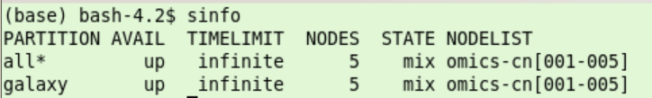
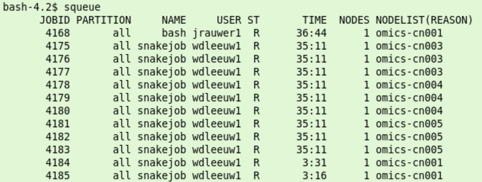

.. Levels are: 
   ###########
   ***********
   ===========
   -----------

Slurm Overview
##############

* Jobs on the compute cluster are scheduled by a queue manager or cluster workload manager, called Slurm.
* Slurm has three key functions. 
    1. It allocates exclusive and/or non-exclusive access to resources (compute nodes) to users for some duration of time.
    2. It provides a framework for starting, executing, and monitoring work (normally a parallel job) on the set of allocated nodes. 
    3. It arbitrates contention for resources by managing a queue of pending work. 
* Although Slurm offers several ways to restrict the use of resources to a maximum, currently Crunchomics is set up to give users a maximum amount of freedom. It is very easy to claim significant parts or even the whole cluster for extended periods of time. We expect users to use this freedom wisely and allow other users to do their work. Keep an eye on the overall system usage while running big jobs. Also free allocations which are not used. If you plan to run very big projects (10.000+ core-hours) you are encouraged to contact us beforehand to discuss distribution of the work in time. If we notice a user is using too much resources we will contact him or her. If necessary we can put restrictions on usage.

Additional help and information
*******************************

This guide only covers a basic introduction/overview of Slurm with a focus on subjects which are specific to the Crunchomics cluster and bioinformatics problems and  targeted at people who have some familiarity with the command line. Lots of information about slurm and the commands to use slurm is availabe from other sources:    

* Detailed help information with the slurm commands is available, e.g. ``sinfo --help``  
* Nice tutorials and intros on the web, e.g. `Slurm quick start <https://slurm.schedmd.com/quickstart.html>`_.

Quick slurm demo
****************  

Information about the cluster
=============================

* ``sinfo`` to get information about the cluster: node names, state, partition (queue)
   *  partition: the queues that are available
   *  state: idle (available for jobs), mix (partly available), down etc. `Slurm codes <https://baobabmaster.unige.ch/slurmdoc/sinfo.html#lbAG/>`_ 
   *  node list: the names of the nodes omics-cn001 to omics-cn005

    
*  ``squeue``: view information about jobs in the queue
    *  JOBID: every job gets a number. You can manipulate jobs via this number (e.g. with ``scancel``)
    *  ST: state, R = running, PD = pending, see: `Slurm state codes <https://slurm.schedmd.com/squeue.html#lbAG/>`_.

Multithreading 
==============

Example of running a multithreaded program, which will be used to illustrate the use of slurm further below. We want to map a collection of reads (**READS**)  to an an organism (**DB**) and write the result to **RESFILE**.  (``/dev/null`` means the data is discarded)

.. code-block::	bash

	#You could run this program interactively on omics-h0.science.uva.nl
	export READS="/zfs/omics/software/doc/Crunchomics_intro/DemoData/sample_1M.fastq"
	export DB="/zfs/omics/software/doc/Crunchomics_intro/DemoData/db/NC_000913_ncbi"
	export RESFILE="/dev/null"
	#
	# single thread: 
	bowtie2 -t  -p 1  -x  $DB -U $READS >  $RESFILE
	# multi threaded  use 4 threads: 
	bowtie2 -t  -p 4  -x  $DB -U $READS >  $RESFILE

srun
====

However, it is more efficient to run this mapping on the compute cluster using the same command in slurm with ``srun`` executed from the head node omics-h0.science.uva.nl:

.. code-block::	bash

	# run bowtie as a single job with 16 cores:
	srun -n 1 --cpus-per-task 16  bowtie2 -t -p 16  -x  $DB -U $READS  >  $RESFILE
	# also possible: run an interactive  shell on a compute node, in this case for 10 minutes:  
	srun --pty -t 10 bash -i 

* Allocation of the compute resource is for the duration of the command. 

salloc
======

Often a job consists of a number of steps (jobsteps)

*  Explicit allocation with ``salloc`` for interactive running of several jobs in row. 

.. code-block::	bash

	# allocate 16 cpu's on a single node, in this case for 30 minutes 
	salloc -n 1 -t 30 --cpus-per-task 16 bash
	# the shell runs on the headnode srun is used to use the allocation 
	# srun uses the available cpu's in the allocation and using
	srun bowtie2 -t  -p 16  -x  $DB -U $READS  >  $RESFILE
	# with salloc we set 16 cpus-per-task. 
	# Slurm holds this information in the variable $SLURM_CPUS_PER_TASK,
	# which we can use in the bowtie command:
	srun bowtie2 -t  -p $SLURM_CPUS_PER_TASK  -x  $DB -U $READS  >  $RESFILE
	#
	# more SLURM variables in the environment: 
	env | grep SLURM  
	#
	# it is not a good idea to ask for more threads than available in the allocation 
	srun bowtie2 -t  -p 64  -x  $DB -U $READS  >  $RESFILE
	# the threads start to compete for the 16 availabe cores.
	# If we ask for less threads than available
	srun bowtie2 -t  -p 2  -x  $DB -U $READS  >  $RESFILE
	# only 2 cores in the allocation  are used
	exit 
	#  Release the allocated resources

sbatch
====== 

srun and salloc wait/block until resources are available. If the cluster is full you have to wait until resources become available. Sbatch is used to send the job to put the job in the queue and schedule it when the resources become available.   

sbatch: create batch file called ``test.sc`` in a text editor on the headnode (e.g. vim, nano, gedit). It has the following content::

	#!/bin/bash
	#SBATCH --cpus-per-task 16
	srun bowtie2 -t  -p $SLURM_CPUS_PER_TASK  -x  $DB -U $READS  >  $RESFILE 

* *Note: the #SBATCH is not a comment but sets the cpus per task variable to 16. See below.*

Submit the created batch file to slurm using sbatch:

.. code-block:: bash

	sbatch test.sc

In batch mode the standard output of the issued commands, which would normally appear in the terminal is written to a file. By default the name of this file is ``slurm-<JOBID>.out``  After a job is submitted it will run independent of the terminal, you can log out and come back later for the results. 

The compute resources that are asked for and other job parameters can be specified by *parameters*. These parameters can be specified on the commandline (like in the salloc example above). For sbatch the parameters can be included in the batch script. The previously given ``#SBATCH --cpus-per-task 16`` is an example in which 16 cpus are asked for. Lines starting with ``#SBATCH`` are interpreted as parameters for the slurm job. Possible parameters can be found in the Slurm documentation: `Sbatch <https://slurm.schedmd.com/sbatch.html>`_	

scancel
======= 
Use scancel to kill running jobs and remove waiting jobs from the queue 

.. code-block:: bash

	scancel [JOBID]

is used to cancel a particular job. All your jobs are killed/removed using: 

.. code-block:: bash

	scancel -u $USER  

